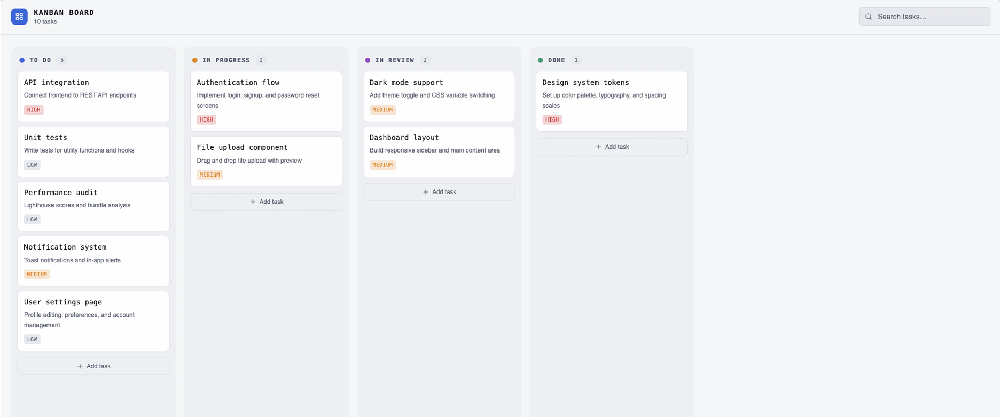

# 📝 ToDo Dashboard – M3aarf Assessment

A Kanban-style ToDo dashboard built with Next.js, React Query, and Material UI as part of a frontend assessment task.

## 🚀 Objective

Build a modern ToDo dashboard that allows users to manage tasks across multiple stages:

Backlog
In Progress
Review
Done

## 🧰 Tech Stack

Next.js (App Router)
React Query (TanStack Query) – Data fetching & caching
Material UI (MUI) – UI components
TypeScript
json-server – Mock backend API

## ✨ Features

📌 Display tasks across 4 Kanban columns
➕ Create new tasks
✏️ Edit existing tasks
❌ Delete tasks
🔄 Drag & drop tasks between columns
🔍 Search tasks (by title or description)
📄 Pagination / Infinite scroll per column
⚡ Cached API data using React Query

## 🎨 Design

The UI follows the provided design:



## 🧪 API (Mock Server)

This project uses json-server as a local mock API.

Start the server:
npx json-server --watch db.json --port 4000

Available endpoints:
GET /tasks → Fetch all tasks
POST /tasks → Create a task
PATCH /tasks/:id → Update a task
DELETE /tasks/:id → Delete a task

## 🖥️ Getting Started

1. Clone the repo

```bash
git clone https://github.com/your-username/to-do-project-ahmed-khorkhash.git
cd to-do-project-ahmed-khorkhash
npm install
npx json-server --watch db.json --port 4000
npm run dev
```
